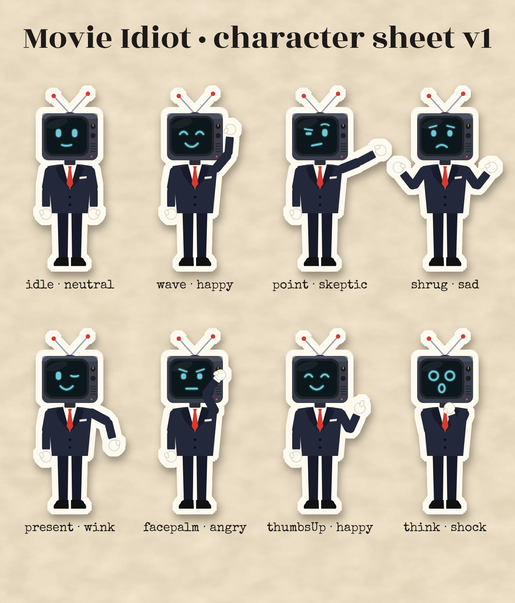

# Collage Shorts: the new production system

For the full system design and roadmap, see [system-outline.md](system-outline.md).

The channel is pivoting from movie reviews to Hindi/Hinglish paper-collage explainers, starting with 9:16 Shorts. Long 7–8 minute videos will reuse the same library later. The old `src/video` stills-essay renderer is left in place but is not the house style.

Golden sample: **`phalke`**, the story of *Raja Harishchandra* (1913): "India's first heroine was a man". All visuals are original vector art and the film is public domain, so there is no Content ID exposure.

## How it is built

| Layer | File | What it does |
|---|---|---|
| Timing | `src/collage/timeline.ts` | Script lines → start/duration/word cues. Estimated until a real voice exists; recordings and speech-service word cues replace the estimate and the whole edit re-times. `clock()` gives frame lookups: `c.line('hook1')`, `c.word('hook1', 'आदमी')`, `c.end('pea1')`. |
| Motion library | `src/collage/primitives.tsx` | Paper, Grain, Cutout (white paper border + shadow around any alpha shape or PNG), Enter (pop/drop/rise/left/right/swing/flip), Float, Jitter (stop-motion on twos), Shake, Camera + Layer (parallax), TornLabel, Stamp, Marker, Draw (self-drawing arrows/routes), Counter, WordDrop, TornWipe, Sfx, Captions (word-highlighted). |
| Art | `src/collage/art.tsx` | Original vector cut-outs: figures, necklace, cinema screen/audience/beam, crown/bow/feather, pot + stepped pea plant, film strip, ship, hand-cranked camera, dev tray, reel, cooking pot, coin, lotus medal, sunburst. |
| Theme | `src/collage/theme.ts` | Palette and self-hosted fonts (`public/fonts`, SIL OFL): Rozha One display, Mukta body/captions/stamps, Kalam handwriting, Special Elite typewriter. |
| A short | `src/collage/shorts/<slug>/` | `script.ts` (lines, title, sources) and the edit component. Register it in `src/collage/shorts/index.ts`. |
| Sound | `scripts/sfx_kit.py` | Original synthesized kit: whoosh, pop, stamp, shutter, coin, riser, paper, projector flicker, tanpura + Bhupali bed. Generated into `public/sfx` (git-ignored) on first render. |
| CLI | `scripts/short.ts` | `npm run short -- list | timing | voice | stills | render`. |

Every frame value comes from `useCurrentFrame()`, `spring`, `interpolate` or Remotion's seeded `random()`, so renders are deterministic.

## Workflow

```bash
npm ci
python -m venv .venv && .venv/bin/pip install numpy edge-tts   # sound kit + optional online voice
npm run short -- stills phalke --every 1        # contact sheets → projects/shorts/phalke/sheet-*.jpg
npm run short -- render phalke --draft          # 540×960 draft → projects/shorts/phalke/draft.mp4
npm run short -- render phalke                  # 1080×1920 final → projects/shorts/phalke/video.mp4
npm run studio:shorts                           # Remotion Studio for timeline scrubbing
```

On Linux the CLI uses `/opt/pw-browsers/.../headless_shell` when present. Set `REMOTION_BROWSER` to point elsewhere.

### Adding the voice

Recommended: **record it yourself**. That is the strongest "this is not mass-produced" signal under YouTube's inauthentic-content policy, and it is the channel's personality.

1. Record each script line as its own file, named by line ID: `public/shorts/phalke/voice/hook1.wav`, `hook2.wav`, … (`.wav`, `.mp3`, `.m4a` or `.ogg`). A phone voice-memo app in a quiet room is fine. Leave ~0.2 s of silence at each end.
2. `npm run short -- timing phalke` measures every file and writes `public/shorts/phalke/timing.json`. Missing lines keep estimated timing.
3. Render. All cuts, stamps and pops move to the real delivery. Within a line, word anchors are spread by word length. For exact word cues, add `<lineId>.words.json` (`[{text,start,end}]`, e.g. from WhisperX) next to the recording.

Alternative: `npm run short -- voice phalke --edge` synthesizes each line with Microsoft's online Hindi voice and saves real word boundaries. This sends the script to Microsoft and needs `speech.platform.bing.com` to be reachable.

## Making the next short

1. Pick a story with a twist that can be told in ~45–60 s and whose visuals you can own (illustrate it, use public-domain or licensed images).
2. Write `script.ts`: one breath per line, spoken Hinglish, a hook that lands in the first 3 seconds, a loop line that echoes the hook. Every claim needs a source in `sources`.
3. Plan one beat per idea. Each beat changes something visually every 1–2 s: an entrance, a stamp, a camera push, a marker. Anchor events to words, not seconds.
4. Reuse primitives; add art to `art.tsx` only when the library lacks it. When a move recurs, promote it into `primitives.tsx`.
5. `stills` → read the contact sheets → fix → `render --draft` → watch → final.

### Review checklist (fail the draft if any is true)

- Anything static for more than ~2 s, or a beat that opens on an empty frame.
- Text wrapping unexpectedly, overlapping a cut-out, or sitting in the bottom ~380 px / right-edge Shorts UI zone.
- Devanagari conjuncts broken (check stamps and display text; Rozha One lacks some, such as श्च).
- On-screen text that only repeats the caption instead of adding a joke, label or number.
- A claim without a source, or a quote that was never said.

## Known gaps / next steps

- **Voice**: none yet in this environment (no reachable TTS). Record lines as above.
- **Photo cut-outs**: `Cutout` already works on transparent PNGs; add a `rembg`/BiRefNet step to cut real public-domain photos (for example Phalke portraits) when the network allows model downloads.
- **Timeline JSON**: shorts are hand-written TSX for now. Once 2–3 shorts exist, extract the repeated beat patterns into a JSON timeline that an agent can edit.
- **Long form**: 16:9 compositions, chapter structure and B-roll pacing for 7–8 minute videos, built on the same primitives.

## Mascot: "Movie Idiot" (TV-head presenter)

The suited TV-head figure is the channel's own avatar; the channel owns the character. `src/collage/characters/` turns it into a reusable vector rig that renders sharp at any size.



### Use it in any video

```tsx
import {Presenter} from '../../characters';

<Presenter
  at="bottom-left"            // 'bottom-left' | 'bottom-right' | 'center' | {x, y}; bottom anchors sit just above the caption band
  width={290}
  enter={ready - 18}          // local frame of the beat when it pops in (exit={…} pops it out)
  talk={false}                // true + timing={timing} timeOffset={from}: mouth flaps on narration words
  cues={[
    {at: ready - 18, expression: 'skeptic'},
    {at: stamps[1], pose: 'shrug', expression: 'sad'},
    {at: no + 6, expression: 'angry'},
    {at: 90, screen: 'static'},  // or any React node shown on the TV screen
  ]}
/>
```

- **Poses:** idle, wave, point, shrug, present, facepalm, thumbsUp, think (spring-blended between cues).
- **Expressions:** neutral, happy, shock, skeptic, wink, sad, angry. Blinking, breathing, sway, antenna wobble and screen flicker are automatic.
- **Lower level:** `TVHead` takes explicit `pose`, `expression`, `mouth` and `screen`; `usePose` and `useMouth` drive them.
- **In the golden sample:** shrugs at the "नहीं" stamps (casting beat), shock then facepalm on the loop reveal.

Use it as a reactor and host, not on every beat: one or two cameos per Short; host segments in long form.

### Brand images

`npm run brand` regenerates transparent 2400×4000 PNGs in `public/brand/` (wave, idle, point, shrug, facepalm, thumbs-up) and `docs/mascot-sheet.jpg`. Use them for thumbnails, channel art and community posts. Other previews: `npx tsx scripts/still.ts mascot-still out.png --scale 4 --props '{"pose":"point","expression":"skeptic"}'`, and the 9 s motion test `mascot-demo` (`npx remotion render src/collage/index.tsx mascot-demo out.mp4`).

v1 was drawn from the avatar's description; match colours and details to the original avatar image when it can be loaded here.
